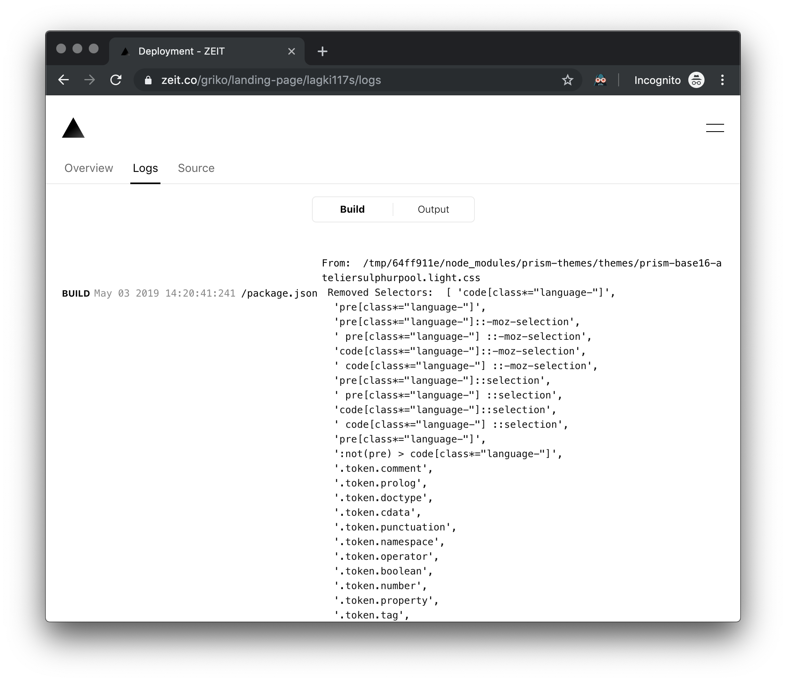

I have a confession to make: *I always try to order everything alphabetically.* Computer files, macOS dock icons and launchpad, basically anything. Even if there's no auto sort feature like on iOS home screen, I'd sort it manually from A to Z until it's sorted. Also my icons on my dock doesn't show names but I still organize it alphabetically.

**Everthing must be in order.**

Even in programming, sorting things alphabetically is a must. Variable declaration, switch values, and especially on package imports. For example, imports on JavaScript are sorted alphabetically and 'package-wise'. Here's a snippet from this [blog post template component](https://github.com/grikomsn/landing-page/blob/v3/src/templates/blog-post-template.js#L1-L11):

```js
import 'prism-themes/themes/prism-base16-ateliersulphurpool.light.css'
import 'prismjs/plugins/line-numbers/prism-line-numbers.css'

import { DiscussionEmbed } from 'disqus-react'
import { graphql, Link } from 'gatsby'
import React from 'react'
import styled from 'styled-components'

import { siteUrl, social } from '../../site-config'
import Head from '../components/Head'
import Layout from '../components/Layout'
import Section from '../components/Section'
import parsePostDate from '../helpers/parsePostDate'
```

First priority must be direct imports like CSS files, then package imports (e.g. `from 'react'`), then relative imports (e.g. `from '../components/Head'`). Because I code using [Visual Studio Code](https://code.visualstudio.com), there's an extension to sort package imports on save or manually using [TypeScript Hero](https://marketplace.visualstudio.com/items?itemName=rbbit.typescript-hero), just don't forget to enable some settings.

Speaking of imports, here's another confession: *I always try to order GatsbyJS plugins alphabetically.* If some plugins have options, it must be grouped after plugins without options, and also alphabetically. Plugin option parameters are also sorted, along with array option values.

**Everthing must be in order.**

Package imports are sorted alphabetically, right? So why not also Gatsby plugins, too? Here's my [`gatsby-config.js` contents from my inital commit of this page](https://github.com/grikomsn/landing-page/blob/9f82903056ecd5485d70afff05d3287eb63ba77d/gatsby-config.js) (with several parts truncated):

```js
'gatsby-plugin-eslint',
'gatsby-plugin-offline',
'gatsby-plugin-react-helmet',
...
{
  resolve: 'gatsby-plugin-purgecss',
  options: { ... },
},
{
  resolve: 'gatsby-plugin-react-svg',
  options: { ... },
},
{
  resolve: 'gatsby-plugin-sass',
  options: { ... },
},
...
```

As you can see, plugins that doesn't have options are positioned topmost, then continued with plugins with options that are also sorted alphabetically. This makes it easy to find and edit package options because it's located below plugins without options. And so that's what I thought.

I kept this structure until I realized something: *none of the CSS classes from Bulma aren't purged on the build process*. I noticed this when looking on the [deployment build log on ZEIT Now](https://zeit.co/griko/landing-page/lagki117s/logs):



As we can see from the build log, what was purged is only selectors from the imported PrismJS stylesheets (which shouldn't be purged). My instant thought is that I should add an exception for that stylesheet or the whole `prism-themes` package. But that doesn't explain why there aren't any unused Bulma CSS selectors showing on the build logs. Then I read [this part of the plugin readme for `gatsby-plugin-purgecss`](https://github.com/anantoghosh/gatsby-plugin-purgecss#usage):

> Add the plugin AFTER other css/postcss plugins

Copied from the snippet above, you can see that the `gatsby-plugin-purgecss` plugin is imported before `gatsby-plugin-sass` (because alphabetically ofc):

```js
'gatsby-plugin-eslint',
'gatsby-plugin-offline',
'gatsby-plugin-react-helmet',
...
{
  resolve: 'gatsby-plugin-purgecss', // highlight-line
  options: { ... },
},
{
  resolve: 'gatsby-plugin-react-svg',
  options: { ... },
},
{
  resolve: 'gatsby-plugin-sass', // highlight-line
  options: { ... },
},
...
```

That means if we follow the order of the plugins, it purges unused selectors first using `gatsby-plugin-purgecss`, then does other things, then imports SASS and SCSS files using `gatsby-plugin-sass`. Which means purging nothing because at first there are none imported. So the solution is exactly what the readme says: *add the plugins after other stylesheet plugins*.

**Everthing must (not always) be in order.**

Looks like I have to adjust my imports accordingly. Not to mention that I also added a blog, the `gatsby-transformer-remark` plugin is now positioned topmost to prevent any conflicts with other plugins. So now, here's what it looks like (with several parts truncated):

```js
// Remark Plugins
{
  resolve: 'gatsby-transformer-remark',
  options: {
    plugins: [
      'gatsby-remark-copy-linked-files',
      'gatsby-remark-prismjs',
      'gatsby-remark-responsive-iframe',
      ...
      {
        resolve: 'gatsby-remark-default-html-attrs',
        options: { ... },
      },
      {
        resolve: 'gatsby-remark-external-links',
        options: { ... },
      },
      ...
    ],
  },
},
// Other Plugins
'gatsby-plugin-catch-links',
'gatsby-plugin-eslint',
'gatsby-plugin-react-helmet',
...
{
  resolve: 'gatsby-plugin-react-svg',
  options: { ... },
},
{
  resolve: 'gatsby-plugin-sass',
  options: { ... },
},
...
// Last-priority Plugins
{
  resolve: 'gatsby-plugin-purgecss',
  options: { ... },
},
```

Note that I added comments to describe sections of the plugins, which also exists in the `gatsby-config.js` file to organize things. Now the order starts from Remark plugin with its plugins sorted from no options to with options, then plugins without options, then plugins with options, and finally the `purgecss` plugin. It's not fully alphabetically sorted, but at least it's much organized that [Dan Abramov's Gatsby config file](https://github.com/gaearon/overreacted.io/blob/master/gatsby-config.js).

So what do I learned from this debacle? **Not everything must be sorted**.

GatsbyJS plugins: 1. OCD: 0.
